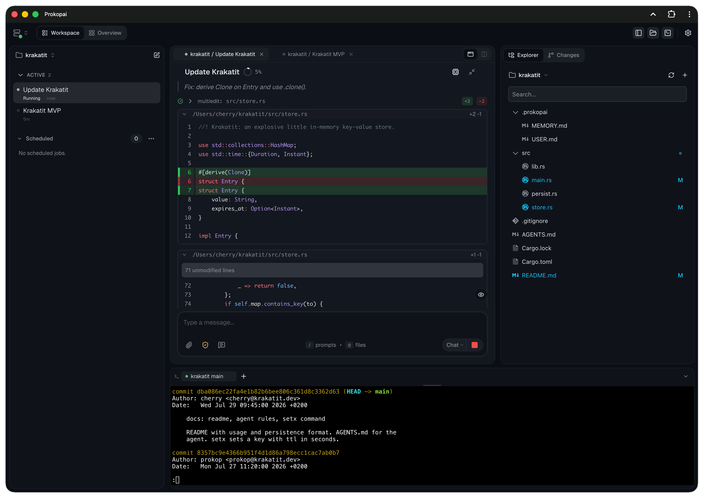

<p align="center">
  
</p>

<h1 align="center">Coding agents that remember how you work.</h1>

<p align="center">
  Prokop is an open-source agentic coding workspace for persistent agents, parallel sessions, and projects that keep their context.
</p>

<p align="center">
  <a href="https://github.com/capek-dev/prokop/releases"></a>
  <a href="LICENSE"></a>
  <a href="https://bun.sh"></a>
  <a href="https://www.typescriptlang.org/"></a>
</p>

<p align="center">
  <a href="https://prokopai.dev">Website</a> ·
  <a href="https://prokopai.dev/get-started/">Get Started</a> ·
  <a href="docs/index.md">Documentation</a> ·
  <a href="https://github.com/capek-dev/prokop/releases">Releases</a> ·
  <a href="https://chromewebstore.google.com/detail/jean2browser/jpahdfmmfmmnacapmkchljmcijoedcpj">Chrome Extension</a>
</p>

---

## Why Prokop

Most coding agents are capable inside one session. Prokop improves the work around and between sessions.

- **Persistent agents:** Give recurring agents their own memory, skills, and searchable history across projects.
- **Separate context:** Agent context follows the agent. Project context stays with the project. Both remain editable.
- **Parallel work:** Run multiple sessions and projects without a desktop full of terminal windows.
- **Complete workspace:** Work with files, diffs, Git, terminals, tools, and permissions in one interface.
- **Desktop and phone:** Use the same responsive PWA through networking you control.
- **Open stack:** No required Prokop account, no telemetry, Apache 2.0.

## Install

**macOS / Linux**

```bash
curl -fsSL https://prokopai.dev/install.sh | bash
```

**Windows PowerShell**

```powershell
irm https://prokopai.dev/install.ps1 | iex
```

Then run:

```bash
prokop init
```

This prepares Prokop, starts the daemon, and opens the client at `http://localhost:8742`. See [Getting Started](docs/getting-started.md) for provider setup.

## How continuity works

```text
Persistent agent
├── Memory and skills
└── Searchable history across projects

Project A
└── Project-specific memory and skills

Project B
└── Project-specific memory and skills
```

Promote a reusable profile to create a persistent agent with its own home workspace. Memory and skills remain visible as files. Search can cover the current session, one workspace, or the agent's history across projects.

Reflection is user-directed. You choose the prompt and schedule. Prokop does not automatically learn from every session or train model weights.

## What is included

| Area | Capabilities |
|---|---|
| **Workspace** | Session board, cross-workspace Overview, files, editor, Git, diffs, persistent terminals |
| **Agents** | Persistent identity, memory, skills, session search, subagents, workflows, scheduled work |
| **Control** | Visible tool calls, scoped permissions, auto-approval boundaries, revocable grants |
| **Client** | Responsive PWA, mobile layout, push support, multi-server connections |
| **Tools** | Filesystem, search, shell, tasks, questions, web fetch, Git worktrees, optional browser tools |
| **Extensibility** | MCP and Capek plugins for providers, tools, memory, workflows, and agent behavior |

The board displays up to six open session panes. The server is not limited to six sessions.

## Models

Direct support: **OpenAI, OpenRouter, DeepSeek, MiniMax, Zhipu, Zhipu Coding, and Codex subscription authentication.**

Anthropic and Google models may be available through OpenRouter, but Prokop has no direct integrations for those providers.

## Prokop and Capek

**Prokop** is the coding workspace: server, client, sessions, projects, agents, terminals, permissions, and schedules.

**[Capek](packages/capek)** is the plugin-based agent runtime underneath it.

Both are written in TypeScript and run on Bun.

## Ownership and current limits

Prokop runs on infrastructure you control, with no required account or telemetry. Your configured model provider still receives the requests sent to it.

The daemon survives closing the browser or terminal, not host sleep, reboot, power loss, or process failure. Remote access requires your own networking, such as Tailscale. Local operation alone is not automatic security hardening.

Prokop is evolving and maintained by one developer. It is used for real daily work, but is not presented as enterprise-ready or production-hardened.

## Documentation

- [Getting Started](docs/getting-started.md)
- [Client and mobile access](docs/client.md)
- [Workspaces and sessions](docs/workspaces.md)
- [Configuration and providers](docs/configuration.md)
- [CLI](docs/cli.md)
- [Tools](docs/tools.md)
- [Security and authentication](docs/auth.md)

## License

[Apache 2.0](LICENSE)
