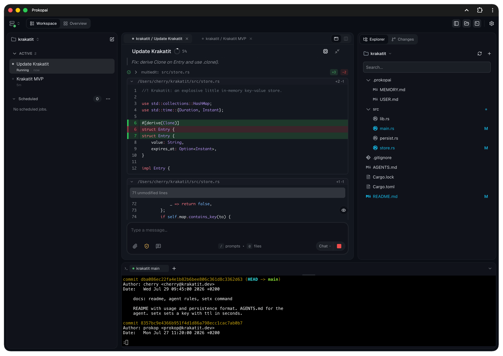

<p align="center">
  
</p>

<h1 align="center">Coding agents that remember how you work.</h1>

<p align="center">
  Prokop is an open-source coding workspace for Claude Code, Codex CLI, and its own built-in agent runtime. Run parallel sessions with persistent agents and projects that keep their context.
</p>

<p align="center">
  <a href="https://github.com/capek-dev/prokop/releases"></a>
  <a href="LICENSE"></a>
  <a href="https://bun.sh"></a>
  <a href="https://www.typescriptlang.org/"></a>
</p>

<p align="center">
  <a href="https://prokopai.dev">Website</a> ·
  <a href="https://prokopai.dev/get-started/">Get Started</a> ·
  <a href="https://prokopai.dev/docs">Documentation</a> ·
  <a href="https://prokopai.dev/how-to">Video Walkthroughs</a> ·
  <a href="https://github.com/capek-dev/prokop/releases">Releases</a> ·
  <a href="https://chromewebstore.google.com/detail/jean2browser/jpahdfmmfmmnacapmkchljmcijoedcpj">Chrome Extension</a>
</p>

---

## Why Prokop

Most coding agents are capable inside one session. Prokop improves the work around and between sessions.

- **Your choice of runtime:** Use Claude Code, Codex CLI, or Prokop's built-in runtime in the same workspace.
- **Persistent agents:** Every primary agent gets its own home, memory, and skills, with searchable history across projects.
- **Automatic learning:** Turn it on to preserve useful lessons from conversations in project or personal knowledge. No scheduled jobs to set up.
- **Separate context:** Agent context follows the agent. Project context stays with the project. Both remain editable.
- **Parallel work:** Run multiple sessions and projects without a desktop full of terminal windows.
- **Complete workspace:** Work with files, diffs, Git, terminals, tools, and permissions in one interface.
- **Desktop and phone:** Use the same responsive PWA through networking you control.
- **Open stack:** No required Prokop account, no telemetry, Apache 2.0.

**New in 1.18.0:** Claude Code and Codex CLI sessions, learning across all three runtimes, shared permission modes, and branch history with push/pull status. [Read the release notes](https://github.com/capek-dev/prokop/releases/tag/server/v1.18.0).

## See it in use

Short videos with written steps:

- [Work across projects in Overview](https://prokopai.dev/how-to/overview) · 25 seconds
- [Work with multiple sessions](https://prokopai.dev/how-to/multiple-sessions) · 24 seconds
- [Set up an agent and workspace capabilities](https://prokopai.dev/how-to/agent-capabilities) · 39 seconds

[All walkthroughs](https://prokopai.dev/how-to), including adding a project and connecting a model provider.

## Install

**macOS / Linux**

```bash
curl -fsSL https://prokopai.dev/install.sh | bash
```

**Windows PowerShell**

```powershell
irm https://prokopai.dev/install.ps1 | iex
```

Prefer to inspect the installer or download a binary yourself? See the [macOS/Linux script](install/install-prokopai.sh), [PowerShell script](install/install-prokopai.ps1), and [release downloads](https://github.com/capek-dev/prokop/releases).

Then run:

```bash
prokop init
```

This prepares Prokop, starts the daemon, and opens the client at `http://localhost:8742`. See [Getting Started](https://prokopai.dev/get-started) for setup, then choose a runtime below.

## Three runtimes, one workspace

A **harness** is the runtime executing a session. Choose Prokop, Claude, or Codex from the model picker before sending the first message.

| Harness | Runs on | What you need |
|---|---|---|
| **Prokop** | The built-in, Capek-based agent runtime | A supported provider connection; no Claude or Codex CLI required |
| **Claude Code** | The installed `claude` CLI | Claude CLI **2.1.259+**, already logged in on the server host |
| **Codex CLI** | The installed `codex` CLI | Codex CLI **0.156.0+**, already logged in on the server host |

The first message locks the session's harness. You can still change its model and effort within that harness. Agents can pin models from any harness, and **New Session** follows the default agent's pin.

Claude and Codex sessions receive the selected agent's instructions and memory, with Prokop tools for workspace memory, agent memory, session search, and agent skill management. Their tool calls and linked subagent activity appear in the workspace, and approvals use Prokop's permission rules.

Both CLI harnesses support image uploads, Stop, native goals, manual compaction, and Edit and Undo. Fork support has harness-specific restrictions, including no forks of image history. They share Prokop's notification rules for finished replies and permission requests.

- **Settings → Server → Harnesses** shows installed CLI versions and lets you disable a CLI harness for new sessions and scheduled jobs without stopping existing sessions.
- **Settings → Server → Usage** shows available subscription limits and reset times. API-key logins show a note instead of plan-usage bars.
- CLI harnesses require a physical project directory and accept **images only as attachments**. Sessions are bound to the CLI version that started them; after upgrading a CLI, existing sessions refuse new messages. Start a new session, or restart a Claude session by editing its first message.

## How continuity works

```text
Persistent agent
├── Memory and skills
└── Searchable history across projects

Project A
└── Project-specific memory and skills

Project B
└── Project-specific memory and skills
```

Every primary agent gets its own home workspace automatically. Manage its capabilities, learning, and home `USER.md` and `MEMORY.md` in **Settings → Agents**. Memory and skills remain visible as files. Search can cover the current session, one workspace, or the agent's history across projects.

### Automatic learning

Turn on learning in a workspace or an agent's home, adjust what you need, and keep working. Prokop automatically reviews eligible conversations and maintains useful knowledge. There is no reflection prompt to write or scheduled job to create.

- **Workspace learning** maintains shared project knowledge from work across participating agents.
- **Personal learning** reviews an agent's own participation across eligible projects and preserves transferable lessons and working preferences in its personal knowledge.
- **Optional skill improvement** lets learning create and refine reusable procedures, not just compact memory notes.

Learning comes with a built-in review prompt and timing defaults. You can tune the model, learning focus, and timing, or choose which projects an agent learns from. Reviews normally run during quiet periods, with a maximum pending age for unreviewed work.

Learning can review conversations from all three harnesses. A learner pinned to a Claude or Codex model also runs its reviews on that harness.

Inspect learning history and source conversations. Reviews run on the Prokop harness also record knowledge diffs and support undoing individual changes without overwriting newer edits. **Reviews run on Claude or Codex cannot be undone from learning history.** You can exclude a session from future learning; exclusion does not erase knowledge already saved.

Learning updates knowledge files, not model weights. It uses your configured model and is separate from scheduled work.

## What is included

| Area | Capabilities |
|---|---|
| **Workspace** | Session board, cross-workspace Overview, files, editor, diffs, persistent terminals |
| **Harnesses** | Prokop, Claude Code, and Codex CLI; one model picker; per-agent model pins |
| **Git** | Worktrees, branch creation and switching, commit history and diffs, ahead/behind status, fetch freshness, commit, fast-forward pull, push, local rebase |
| **Agents** | Persistent identity, automatic home workspace, memory, skills, session search, subagents |
| **Learning** | Opt-in project and personal learning across harnesses, optional skill improvement, history; diffs and undo for Prokop-run reviews |
| **Scheduling** | Create and manage scheduled jobs from the app, with a selected model and harness |
| **Control** | Visible tool calls, Standard / Extended / Full permission modes, scoped and revocable grants |
| **Client** | Responsive PWA, mobile layout, push support, multi-server connections |
| **Prokop tools** | File reading and editing, search, shell, terminals, todos, questions, document conversion, web fetch, opt-in browser tools |
| **Extensibility** | Workspace MCP servers; Capek plugins for the built-in runtime |

The board displays up to six open session panes. The server is not limited to six sessions.

## Providers for the Prokop harness

Connect **OpenRouter, DeepSeek, MiniMax, or Z.AI (Coding Plan)**, or use **Codex (ChatGPT) subscription authentication** in **Providers & Models**.

The Codex provider runs models through Prokop's built-in runtime. It is separate from the **Codex CLI harness**, which runs the installed CLI using its own login.

Available models depend on the integration and Prokop's supported model configuration. Anthropic and Google models may be available through OpenRouter. The Prokop harness has no direct Anthropic or Google provider integration; Claude Code is available through its separate CLI harness. Standalone OpenAI API and plain Z.AI providers are no longer supported.

## Permissions and live updates

**Standard, Extended, and Full** permission modes apply across all three harnesses. Command and file-operation asks identify concrete concerns, such as paths outside the workspace, secrets, destructive actions, or unknown code. Commands classified as catastrophic still require approval in every mode.

Git status, files, scheduled jobs, session lists, and running indicators receive server-pushed updates across open clients. External editor changes and commits made in a terminal are picked up on window focus or the next tool call, not by a continuous filesystem watcher.

## Prokop and Capek

**Prokop** is the coding workspace: server, client, sessions, projects, agents, terminals, permissions, and schedules.

**[Capek](https://github.com/capek-dev/capek)** powers Prokop's built-in harness. Claude Code and Codex CLI run through separate adapters to their installed CLIs, rather than through Capek's model providers.

Both are written in TypeScript and run on Bun.

## Ownership and current limits

Prokop runs on infrastructure you control, with no required account or telemetry. Your configured model provider or CLI service still receives the requests sent to it.

The daemon survives closing the browser or terminal, not host sleep, reboot, power loss, or process failure. Remote access requires your own networking, such as Tailscale. Local operation alone is not automatic security hardening.

Prokop is evolving and maintained by one developer. It is used for real daily work, but is not presented as enterprise-ready or production-hardened.

## Documentation

- [Getting Started](https://prokopai.dev/get-started)
- [Client and mobile access](https://prokopai.dev/docs/client)
- [Workspaces and sessions](https://prokopai.dev/docs/workspaces)
- [Configuration and providers](https://prokopai.dev/docs/configuration)
- [CLI](https://prokopai.dev/docs/cli)
- [Tools](https://prokopai.dev/docs/tools)
- [Security and authentication](https://prokopai.dev/docs/security)

## License

[Apache 2.0](LICENSE)
